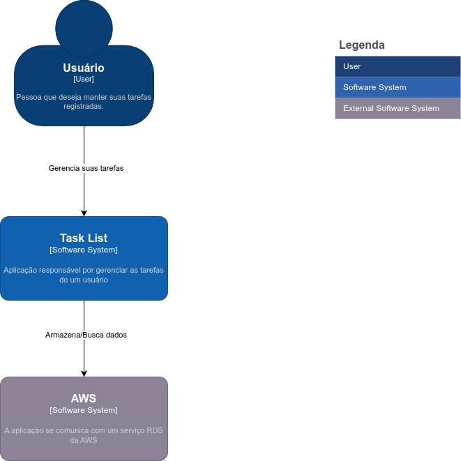

# Documentação do Task List utilizando C4 Model

Nessa parte vou abordar a utilização da aplicação Task List utilizando o C4 Model apenas no nível de contexto, por se tratar de uma atpliação simples não há a necessidade de se aprofundar mais.

A aplicação consiste em um usuário acessar um frointend para que ele possa criar, listar, editar, excluir e completar suas tarefas diárias. Esse front contará com um backend que vai manter um dados em um banco de dados externo.

