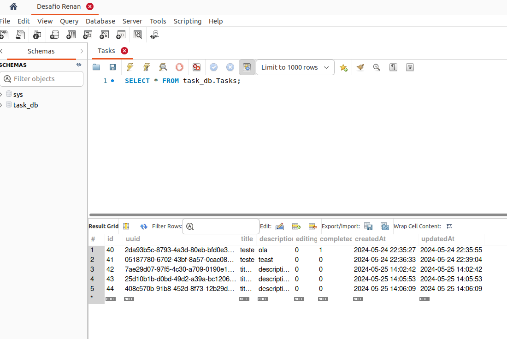

# Banco de dados MySQL no projeto Todo List

## Visão Geral

O banco de dados escolhido foi o MYSQL, um tipo de banco relacionado muito famoso, que se encontra hospedado no RDS, um serviço da Amazon.

### Implementação no Todo List

- **Modelagem de Dados:** Os esquemas de dados foram feitos através da lib Sequelize.
- **Integração com o Backend:** A conexão entre o Mysql e o backend é feita usando os drivers oficiais, garantindo uma integração suave e segura.
- **Desempenho Afinado:** Implementei índices e outras otimizações para assegurar que as consultas sejam rápidas e eficientes, especialmente conforme aumentamos a quantidade de dados.

