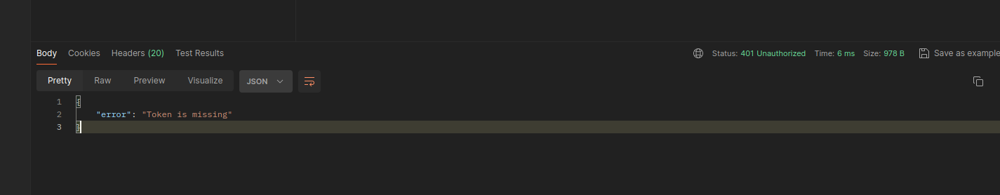
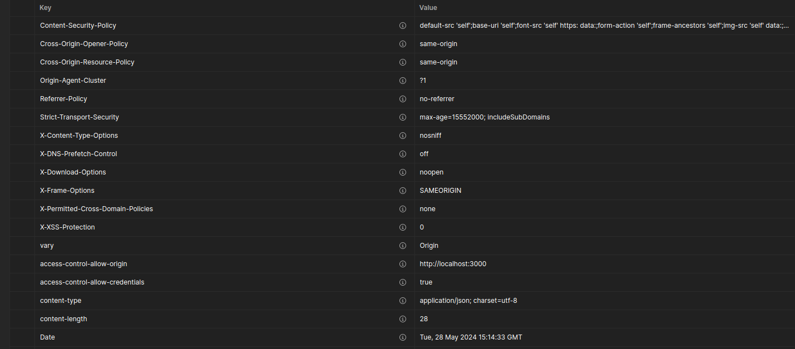

# Práticas de Segurança no Backend do Todo List

## Visão Geral

Este texto detalha as práticas e configurações de segurança que implementei no backend. Reconheço a importância crítica da segurança no desenvolvimento de aplicações, especialmente em ambientes de backend onde dados sensíveis são manipulados e armazenados. Aqui estão descritas as técnicas e os middlewares de segurança utilizados para proteger o sistema. Foi escolhido uma autenticação simples de Basic Authentication pois como disse é simples e fácil de se implementar, apesar da fácil quebra de segurança que esse método oferece.

## Middlewares e Configurações de Segurança

### 1. Authenticate Middleware (authenticate.middleware.ts)

- **Vulnerabilidade:** Acesso não autorizado e elevação de privilégios.
- **Defesa:** Verifico os Basic Tokens em cada requisição para assegurar que somente usuários autenticados tenham acesso.

### 2. CORS Middleware (cors.middleware.ts)

- **Vulnerabilidade:** CORS mal configurado.
- **Defesa:** Defino políticas estritas sobre quais domínios podem interagir com o backend, limitando o acesso apenas a origens confiáveis.

### 3. Rate Limit Middleware (rate-limit.middleware.ts)

- **Vulnerabilidade:** Ataques de força bruta e DoS.
- **Defesa:** Imponho limites na quantidade de requisições permitidas por IP ou usuário para proteger contra sobrecarga e acesso não autorizado.

### 4. Helmet Middleware (helmet.middleware.ts)

- **Vulnerabilidade:** Ataques baseados em headers HTTP.
- **Defesa:** Configuro várias medidas de segurança para proteger contra clickjacking, sniffing de MIME type e XSS, incluindo Content Security Policy, X-Frame-Options e X-Content-Type-Options.

