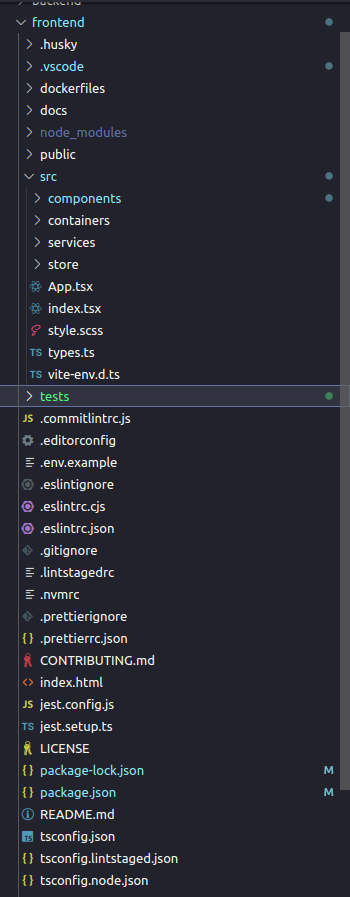

#### Visão Geral

Este documento oferece uma visão técnica detalhada da estrutura do projeto Todo List. A disposição dos diretórios e arquivos foi pensada para refletir claramente as diferentes camadas da arquitetura, separando as responsabilidades e tornando mais fácil entender e gerenciar o código.

Estrutura de Diretórios
Logo abaixo está detalhamento técnico da estrutura de diretórios adotada e o propósito de cada diretório:

- **/components:** Segue o princípio do Atomic Design, dividindo componentes em átomos, moléculas e organismos. Esta estrutura promove reutilização e manutenção ao encapsular a lógica e o estilo de UI.
- **/containers:** A abordagem baseada em contêiner com componentes é uma boa maneira de aumentar a eficiência, escalabilidade e modularidade de um aplicativo React.
- **/services:** Agrupa lógica de negócios e comunicação com APIs externas, isolando a lógica de rede do restante do código.
- **/store:** Configuração e lógica do Redux Toolkit para gerenciamento de estado global.

