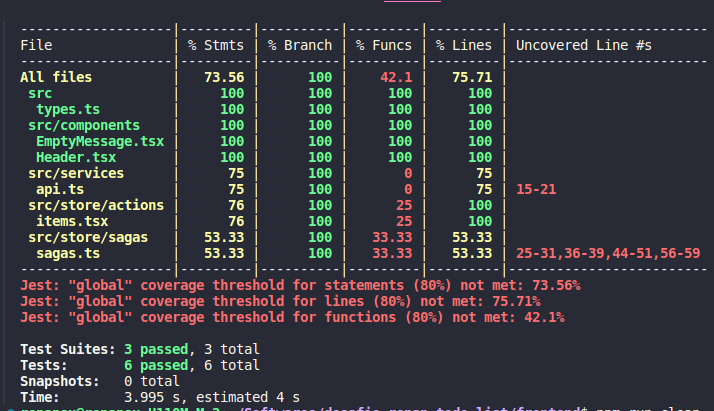

# Estratégias e Ferramentas de Teste no Todo List

## Visão Geral

Neste documento, vou detalhar as estratégias e ferramentas de teste que implementei. Cada uma delas tem um papel crucial em garantir a qualidade, segurança e performance do aplicativo.

## Estratégias de Teste Implementadas

### 1. Testes Unitários (Jest)

- **Descrição:** Escrevi uma série de testes unitários para verificar partes isoladas do código, como funções e métodos. Para os componentes React, utilizei o Jest juntamente com a Testing Library.
- **Benefícios:** Isso garante que cada módulo ou serviço funcione corretamente por si só, além de validar a integração entre eles e os fluxos de negócio do aplicativo.

### 2. Linting e Formatação de Código (ESLint + Prettier)

- **Descrição:** Utilizei o ESLint e o Prettier para manter o código limpo e padronizado. O ESLint ajuda a identificar problemas no código, enquanto o Prettier assegura uma formatação consistente.
- **Benefícios:** Juntos, essas ferramentas aumentam a legibilidade e facilitam a manutenção do código, além de ajudar a prevenir bugs sutis e manter um padrão de qualidade elevado.

## Conclusão

Implementar essas estratégias e ferramentas de teste foi essencial para garantir a qualidade, segurança e performance do Todo List. Elas ajudaram a manter o código limpo e organizado, além de prevenir bugs e comportamentos inesperados.
